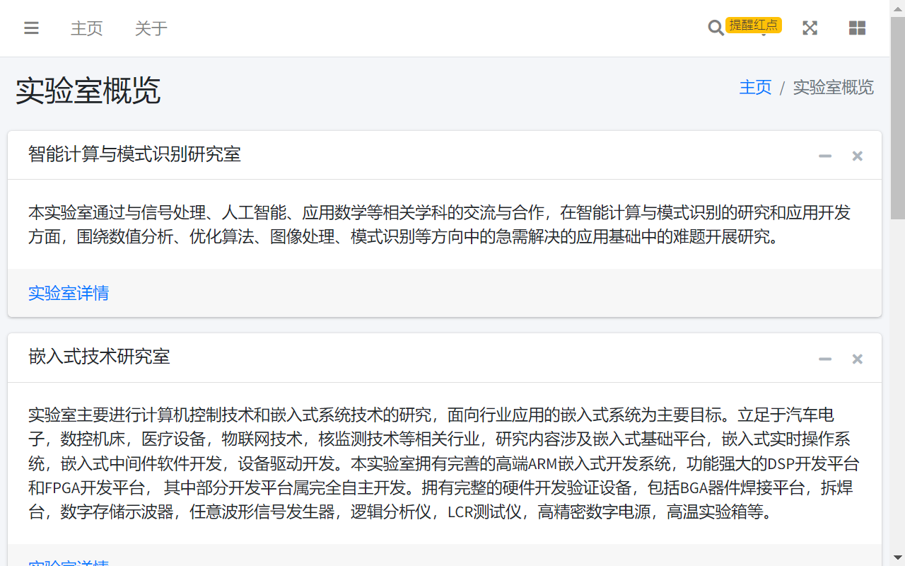

# 实验室可视化志愿填报分析系统
基于AdminLTE - Bootstrap 4 Admin Dashboard(https://adminlte.io)

**AdminLTE** is a fully responsive administration template. Based on **[Bootstrap 4.6](https://getbootstrap.com/)** framework and also the JS/jQuery plugin.
Highly customizable and easy to use. Fits many screen resolutions from small mobile devices to large desktops.

**Preview on [AdminLTE.io](https://adminlte.io/themes/v3)**

## 快速上手
可先根据导图的功能设计分析需求，在pages文件夹下有模板页面
- pages/charts即图表模板，用于数据统计及分析
- pages/examples即网页几乎全部内容的基础模板，多为空白/商业模板
- pages/forms即文件上传/文本编辑器等相关网页的模板
- pages/layout提供了多种空白的网站布局
- pages/mailbox即站内信功能的模板
- pages/search即搜索功能的模板
- pages/tables即一些内容表格的模板

## 问题/提议
- 直接在issues提出即可，最好附上图片

## 预览

## License

AdminLTE is an open source project by [AdminLTE.io](https://adminlte.io) that is licensed under [MIT](https://opensource.org/licenses/MIT).
AdminLTE.io reserves the right to change the license of future releases.

## Image Credits

- [Pixeden](http://www.pixeden.com/psd-web-elements/flat-responsive-showcase-psd)
- [Graphicsfuel](https://www.graphicsfuel.com/2013/02/13-high-resolution-blur-backgrounds/)
- [Pickaface](https://pickaface.net/)
- [Unsplash](https://unsplash.com/)
- [Uifaces](http://uifaces.com/)
